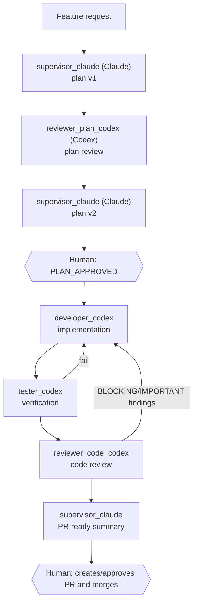

# CAO feature-delivery profiles

This repository contains a set of agent **profiles** for
[cli-agent-orchestrator (CAO)](https://github.com/awslabs/cli-agent-orchestrator),
AWS Labs' CLI tool for orchestrating multiple coding-agent CLIs (Claude Code,
Codex, ...) on a shared task. Each `.md` file under [`profiles/`](./profiles)
defines one CAO agent profile (its provider, role, MCP servers, and system
prompt); together they implement a repeatable, human-gated feature workflow.



## Install

From this directory:

```bash
for profile in *.md; do
  [ "$profile" = "README.md" ] || cao install "$profile"
done
```

Or install each profile separately with `cao install <file>.md`.

## Start a feature

Start CAO server in one terminal:

```bash
cao-server
```

From the target repository in a second terminal:

```bash
cao launch --agents feature_supervisor --provider claude_code --auto-approve
```

Then request a feature with:

```text
New feature: <description>. Apply the standard feature-delivery workflow.
```

## Notes

- `tester_codex` uses the `developer` role only because it needs command-running
  capability. Its prompt forbids writes; create a custom CAO `tester` role if
  you need that prohibition enforced mechanically.
- The standard `supervisor` role is intentionally not allowed to create a PR.
  The pack therefore stops at a PR-ready summary and keeps PR creation and merge
  human-controlled. Add a narrowly scoped GitHub MCP permission only if you
  deliberately want to automate PR creation.
