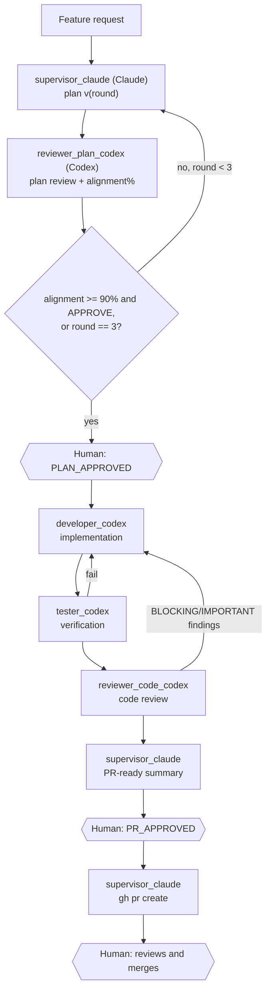

# CAO feature-delivery profiles

This repository contains a set of agent **profiles** for
[cli-agent-orchestrator (CAO)](https://github.com/awslabs/cli-agent-orchestrator),
AWS Labs' CLI tool for orchestrating multiple coding-agent CLIs (Claude Code,
Codex, ...) on a shared task. Each `.md` file under [`profiles/`](./profiles)
defines one CAO agent profile (its provider, role, MCP servers, and system
prompt); together they implement a repeatable, human-gated feature workflow.



## Install

From this directory:

```bash
for profile in *.md; do
  [ "$profile" = "README.md" ] || cao install "$profile"
done
```

Or install each profile separately with `cao install <file>.md`.

## Start a feature

Start CAO server in one terminal:

```bash
cao-server
```

From the target repository in a second terminal:

```bash
cao launch --agents feature_supervisor --provider claude_code --auto-approve
```

Then request a feature with:

```text
New feature: <description>. Apply the standard feature-delivery workflow.
```

`supervisor_claude` runs `gh pr create` once you approve the PR (see below), so
`gh` must be authenticated (`gh auth status`) in the environment where the
supervisor runs.

## Notes

- The plan review loop (`supervisor_claude` ↔ `reviewer_plan_codex`) stops as
  soon as the reviewer reports `alignment >= 90%` with `verdict=APPROVE`, or
  after 3 rounds — whichever comes first. `alignment` is a self-assessed
  confidence signal from the Codex reviewer, not a deterministic metric, so
  the 3-round cap (not the threshold) is what guarantees termination. If the
  cap is hit first, the human sees the unresolved findings before approving.
- `tester_codex` uses the `developer` role only because it needs command-running
  capability. Its prompt forbids writes; create a custom CAO `tester` role if
  you need that prohibition enforced mechanically.
- `supervisor_claude` extends the standard `supervisor` role with
  `execute_bash` so it can run `gh pr create` after you send `PR_APPROVED`; it
  never merges. Note that this is a **prompt-level** guarantee, not a CAO
  tool-level one: once `execute_bash` is granted, CAO cannot mechanically
  restrict it to only `gh pr create` (see
  [tool-restrictions.md](https://github.com/awslabs/cli-agent-orchestrator/blob/main/docs/tool-restrictions.md),
  "MCP tools" and `allowedTools` limitations). Back this up with a GitHub
  branch-protection rule (require review, disallow direct merge for the
  account/token the supervisor uses) so "never merge" is enforced outside the
  prompt too.
